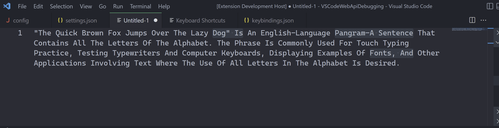
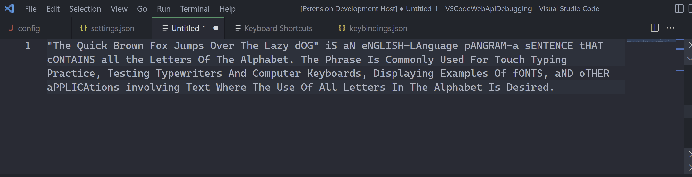

# Simple Case Extension for VS Code

This extension allows you to quickly transform the charactors or selected texts. If there is no selection, the char after cursor will  be transformed, and the cursor will advance itself after the trasnformation to enable the seamless trasnformation process which is the main purpose motivating me to create this extension different from the built-in `Transform to Lowercase/Uppercase` command. This extension supports multiple cursors and multiple selections.

## Commands
- `Simple Case Commands`: List all Simple Case commands.
- `Simple Case Lower`: Transform to lowercase. Shortcut: <kbd>alt</kbd>+<kbd>u</kbd>
- `Simple Case Upper`: Transform to uppercase. Shortcut: <kbd>shift</kbd>+<kbd>alt</kbd>+<kbd>u</kbd>
- `Simple Case Toggle`: Toggle between lowercase and uppercase. Shortcut: <kbd>alt</kbd>+<kbd>t</kbd>

## How to Use
There are two ways to use the functionality provided by this extension.
- One way is through VS Code's Command Palette by enter <kbd>Ctrl</kbd>+<kbd>shift</kbd>+<kbd>P</kbd> on Windows and Linux, or  <kbd>CMD</kbd>+<kbd>shift</kbd>+<kbd>P</kbd> on OSX. Then type `Simple Case`, and select one of the displayed **Simple Case** commands which you want to execute.
- The another way is to directly use one of the keyboard shortcuts listed above.

- Here is a demo showing how the `Simple Case` works.

- Here is a demo showing all `Simple Case` commands.

## Release Notes

### 1.0.0

Initial release of Simple Case Extension.
